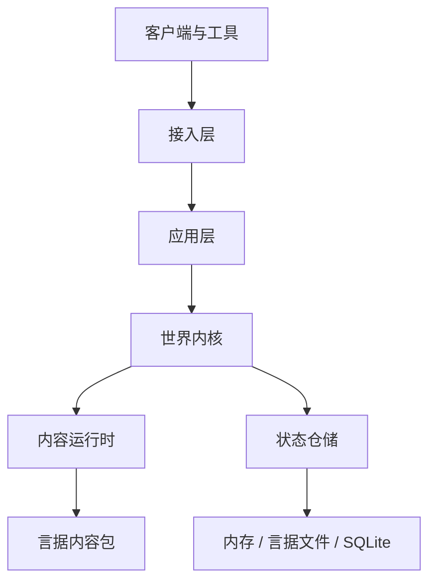

# 言域

**言域（YanYu MUD Engine）** 是一个完全以言序组织游戏逻辑、以言据描述世界内容、采用事件驱动和组合式实体架构的现代中文 MUD 游戏引擎。

> 以言据定义世界，以组件组合实体，以系统表达规则，以事件驱动变化，以协议隔离边界，以言序编写游戏。

当前版本：**0.1.0（工程基线）**。仓库正在按可运行阶段推进；尚未完成的 1.0 能力不会在本文中冒充可用能力。

## 当前能力

- 言序 1.1.7 格式 2 工程、精确 Git 修订依赖与最小宿主权限。
- 独立公共入口、中文 CLI 入口和机器可检查的版本信息。
- Windows、Linux、macOS 的静态检查、规格测试和构建工作流基线。
- 引擎、具体游戏、静态内容、动态状态、协议接入和持久化的分层边界。
- 生态依赖采用范围与替代方案记录在 `docs/ECOSYSTEM_REVIEW.md`。

## 架构



世界内核只接受命令、会话上下文和领域事件，只返回结构化消息与变更集。Telnet、ANSI、WebSocket、HTML 和数据库实现不能反向进入内核。

## 安装

需要：

- 言序 1.1.7 或兼容的 1.x 版本；
- Git；
- 首次锁定 Git 依赖时可访问 GitHub。

```bash
git clone https://github.com/LiuXiu233/yanxu-mud.git
cd yanxu-mud
yanxu 包 锁 .
yanxu 查 src/言域.yx
yanxu 试 tests
```

## 五分钟开始

查看版本与命令：

```bash
yanxu run tools/言域.yx -- 版本
```

言序中文命令等价写法：

```bash
yanxu 行 tools/言域.yx -- 版本
```

当前阶段仅开放 `版本`；后续阶段将依次开放项目创建、内容检查、运行、测试、构建、迁移、快照和诊断。

公共入口示例：

```yanxu
引「包:言域」为 言域；

言 言域.名称；
言 言域.服务器信息（）；
```

言据内容会采用稳定编号和无代码数据，例如：

```yanju
据【
  「包编号」：「青石镇」，
  「版本」：「1.0.0」，
  「入口」：列【「房间.yj」，「物品.yj」】，
  「热重载」：真
】
```

## 示例游戏与接入

“青石镇”示例、Telnet、WebSocket 和浏览器客户端属于后续可运行阶段；在对应实现和测试合入前不提供虚假启动命令。完成后的稳定命令约定为：

```bash
yanxu run tools/言域.yx -- 运行 examples/青石镇
telnet 127.0.0.1 4000
```

浏览器客户端的默认开发地址将为 `http://127.0.0.1:8080/`，实际端口始终以启动诊断输出为准。

## 兼容性与状态

- 言序：`>=1.1.7`；稳定版将支持最新兼容 1.x。
- 言据格式：v1。
- 包清单：v2；锁文件：v2。
- 操作系统：Windows、Linux、macOS；平台差异必须显式测试或明确条件跳过。

兼容承诺见 `COMPATIBILITY.md`，安全报告方式见 `SECURITY.md`。

## 路线图

- 0.1：仓库、依赖调研、工程、CI。
- 0.2：实体组件、系统、命令、事件、消息、事务、内存仓储。
- 0.3：内容包、Schema、原型、本地化、热重载。
- 0.4：言据文件与 SQLite、快照、迁移、事件日志。
- 0.5：账户、角色与完整基础玩法。
- 0.7：控制台、Telnet、WebSocket、HTTP 与 Web 客户端。
- 0.9：插件、管理工具、基准和完整文档。
- 1.0：冻结协议、全量验证和稳定发布。

## 许可证

[MIT](LICENSE) © 2026 刘秀。
