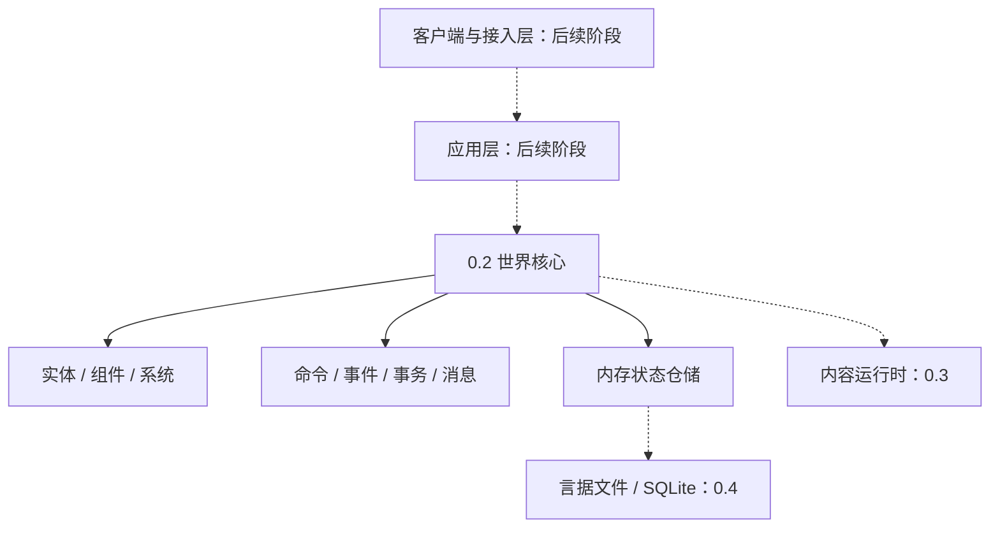

# 言域

**言域（YanYu MUD Engine）** 是一个完全以言序组织游戏逻辑、以言据描述世界内容、采用事件驱动和组合式实体架构的现代中文 MUD 游戏引擎。

> 以言据定义世界，以组件组合实体，以系统表达规则，以事件驱动变化，以协议隔离边界，以言序编写游戏。

当前版本：**0.2.0（世界核心预览）**。本版本可用于编写和测试纯世界规则；公共 API 在 1.0 前仍可能调整。尚未完成的内容运行时、通用玩法、网络接入和生产持久化不会在本文中冒充可用能力。

## 当前能力

- 实体快照、修订和变更集，未知组件往返保留，原型组件与标签合并。
- 组件定义、Schema、默认值和逐版迁移注册表，附带 22 种通用组件定义。
- 可排序、禁用、替换、装饰并管理生命周期的系统注册表。
- 中英命令解析、引号参数、权限、前置条件、冷却、中间件和结构化结果。
- 意图、事实和系统事件，确定性订阅、队列、重放、递归与预算边界。
- 16 种结构化消息节点，以及纯文本、ANSI Telnet、Web JSON 和 Web 言据渲染。
- 世界事务发件箱、事件驱动世界轮次、可注入虚拟时钟和可快照调度器。
- 状态仓储协议与内存实现：查询、乐观修订、事务、世界变量、计划任务、快照、迁移记录和故障注入。
- 言序 1.1.7 格式 2 工程、实名子模块导出，以及 Windows、Linux、macOS 验证基线。

0.2.0 提供“系统协议和注册表”，不表示移动、战斗、任务等通用玩法系统已经实现。这些属于后续阶段。

## 架构



世界核心只接受结构化输入，只返回结构化消息、领域事件和状态变更。Telnet、ANSI、WebSocket、HTML 和数据库实现不能反向进入内核。

## 安装

需要：

- 言序 1.1.7；
- Git。

仓库已附带锁定的依赖源码。

```bash
git clone https://github.com/LiuXiu233/yanxu-mud.git
cd yanxu-mud
yanxu 包 锁 .
yanxu 查 src/言域.yx
yanxu 试 tests
yanxu 编 . -o build --release
```

## 五分钟开始

查看版本：

```bash
yanxu tools/言域.yx -- 版本
```

字节码 VM 等价写法：

```bash
yanxu 字节 tools/言域.yx -- 版本
```

按清单权限运行包入口：

```bash
yanxu 包 运行 . -- 版本
```

当前 CLI 仅开放 `版本`；核心能力通过言包子模块使用。

```yanxu
引「包:言域/实体」为 实体；
引「包:言域/消息」为 消息；
引「包:言域/内存仓储」为 内存；
引「包:言域/世界事务」为 事务；

定 仓储 为 内存.新仓储（）；
定 玩家 为 实体.新实体（「青石镇:角色/子衿」，「青石镇:原型/游客」）；
仓储.写入实体快照（玩家.快照（），空）；

定 所事务 为 事务.开始（仓储，「tx-1」）；
所事务.设置世界变量（「在线人数」，1）；
所事务.暂存消息（消息.新消息（【消息.文字（「你站在青石桥边。」）】，{}））；
定 提交结果：典 为 所事务.提交（）；
```

言据内容将使用稳定编号和无代码数据，例如：

```yanju
据【
  「包编号」：「青石镇」，
  「版本」：「1.0.0」，
  「入口」：列【「房间.yj」，「物品.yj」】，
  「热重载」：真
】
```

[公共 API 索引](docs/API.md) 列出全部可导入子模块；各协议的语义、错误和预算边界见 `docs/` 中的中文专题文档。

## 示例游戏与接入

“青石镇”示例、本地交互控制台、Telnet、WebSocket 和浏览器客户端尚未在 0.2.0 实现，因此本版本没有可用的游戏启动命令、Telnet 端口或 Web 地址。路线图中的目标命令是：

```bash
yanxu tools/言域.yx -- 运行 examples/青石镇
telnet 127.0.0.1 4000
```

实现后，浏览器客户端的默认开发地址将为 `http://127.0.0.1:8080/`，实际端口以启动诊断输出为准。

## 兼容性与状态

- 言序：当前验证版本为 `1.1.7`，清单下限为 `>=1.1.7`。
- 言据格式：v1。
- 包清单：v2；锁文件：v2。
- 操作系统：Windows、Linux、macOS；平台差异必须显式测试或明确条件跳过。
- 0.x 是预览系列；1.0 前不承诺公共 API 和存档格式稳定。

兼容承诺见 `COMPATIBILITY.md`，安全报告方式见 `SECURITY.md`，实际生态依赖边界见 `docs/ECOSYSTEM_REVIEW.md`。

## 路线图

- 0.1：仓库、依赖调研、工程、CI。
- 0.2：实体组件、系统注册、命令、事件、消息、事务、世界循环、虚拟时钟和内存仓储。（当前）
- 0.3：内容包、Schema、原型、本地化、热重载。
- 0.4：言据文件与 SQLite、快照、迁移、事件日志。
- 0.5：账户、角色与完整基础玩法。
- 0.7：控制台、Telnet、WebSocket、HTTP 与 Web 客户端。
- 0.9：插件、管理工具、基准和完整文档。
- 1.0：冻结协议、全量验证和稳定发布。

## 许可证

[MIT](LICENSE) © 2026 刘秀。
