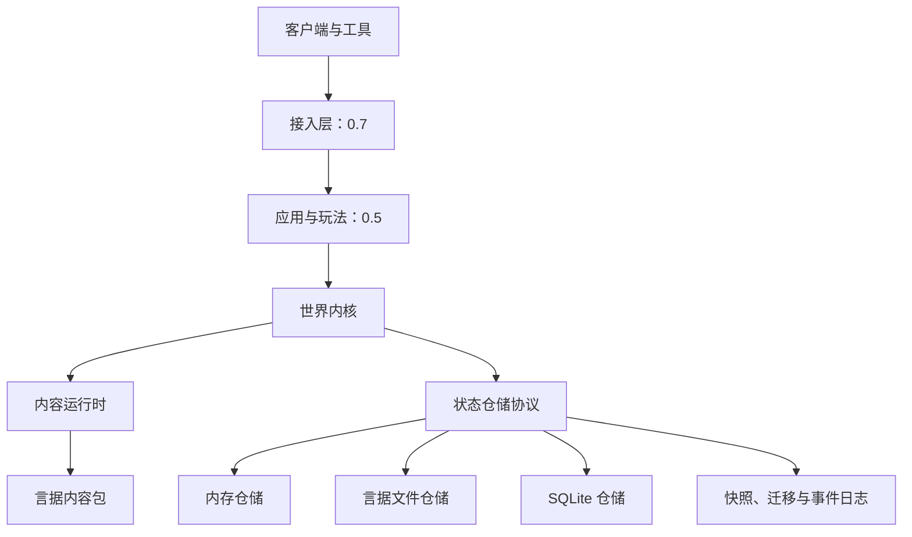

# 言域

**言域（YanYu MUD Engine）** 是一个完全以言序组织游戏逻辑、以言据描述世界内容、采用事件驱动和组合式实体架构的现代中文 MUD 游戏引擎。

> 以言据定义世界，以组件组合实体，以系统表达规则，以事件驱动变化，以协议隔离边界，以言序编写游戏。

最新发布版本：**0.4.1（持久化预览）**。`main` 正在开发 0.5.0，已加入账户、角色、权限、空间、物品、背包、装备、属性、状态、冷却、技能、战斗、死亡、任务、对话、掉落、时间和刷新服务，但完整玩法和网络接入尚未完成；公共 API 在 1.0 前仍可能调整。

## 特性

- 实体快照、修订、变更集、原型组件合并，以及 24 种带 Schema 和迁移入口的通用组件。
- 可排序、禁用、替换、装饰并管理生命周期的系统注册表。
- 中英命令、权限、前置条件、冷却、中间件和结构化结果。
- 原子账户与角色生命周期、确定性权限展开、管理员引导和末位管理员保护。
- 内容驱动的房间移动与只读观察，以及人物、物品和出口结构化场景消息。
- 静态物品定义与动态实例分离，支持原子创建、拾取、放下、容器转移、容量回滚和结构化背包查看。
- 原子穿戴与卸下、显式装备槽，以及按稳定来源确定性重算并同步战斗投影的通用属性。
- 内容驱动的定时状态、刷新或叠加策略，以及不会被装备重算覆盖的统一属性来源聚合。
- 可注入世界时间的实体冷却、内容驱动技能与可替换行为注册表，以及同事务提交的冷却、技能效果、事件和消息。
- 确定性伤害、同位置战斗、技能伤害行为、死亡事实与审计元数据，以及支持权限和可选迁移位置的原子复活。
- 内容驱动的多步骤任务、受信任进度事实、完成奖励描述，以及可恢复节点状态和结构化人物消息的原子对话流程。
- 内容驱动的确定性掉落表、可注入随机与实例编号来源，以及和物品实例、幂等状态、事件及消息同事务提交的掉落结算。
- 持久计划任务、可替换任务行为、单调世界时间，以及行为效果与删除或重排确认同事务提交的失败重试调度。
- 内容驱动的定时刷新、存活实例上限、死亡排除，以及生成实例与任务重排同事务提交的整批失败重试。
- 意图、事实和系统事件，确定性订阅、队列、重放、递归与预算限制。
- 16 种结构化消息节点，以及纯文本、ANSI Telnet、Web JSON 和 Web 言据渲染。
- 世界事务发件箱、无高频空转的世界轮次、持久调度器，以及用于规格测试的虚拟时钟和快照调度器。
- 状态仓储协议，以及内存、内容寻址言据文件和 SQLite 三种完整实现。
- 世界快照、恢复预检与恢复后摘要验证，有严格历史前缀和整批回滚的数据迁移。
- 与状态同世代提交的哈希链事实事件日志，支持查询、审计和确定性重放。
- 言据内容包、语义版本依赖、Schema、跨包引用、原型继承、本地化和行为编号校验。
- 确定性内容图、差异与影响分析，以及有代数检查和原子提交语义的热重载运行时。
- 中文内容检查、构建、打包和差异 CLI；制品包含 SHA-256 摘要并支持回读校验。
- 独立的“青石镇”示例内容：13 个房间、9 个物品、5 个 NPC、4 组对话、2 个任务、2 张掉落表、2 个刷新定义、2 个状态定义和 3 个技能定义。

## 架构



世界内核只接受结构化输入，只返回结构化消息、领域事件和状态变更。Telnet、ANSI、WebSocket、HTML 与数据库实现不能反向进入内核；静态内容不进入动态状态仓储。

## 安装

需要言序 `1.1.12`、SQLite `3.38.0+` 和 Git。仓库锁定并附带经过审查的依赖源码；完整测试会执行真实 SQLite 往返，不静默跳过。

```bash
git clone https://github.com/LiuXiu233/yanxu-mud.git
cd yanxu-mud
yanxu 包 锁 .
yanxu 查 src/言域.yx
yanxu 试 tests
yanxu 编 . -o build --release
```

如果 `sqlite3` 不在 `PATH`，请将 `YANYU_SQLITE3` 设置为 SQLite CLI 的绝对路径。

完整验证可在 Windows 运行 `./scripts/verify.ps1`，在 Linux 或 macOS 运行 `./scripts/verify.sh`。

## 五分钟开始

查看版本和 CLI 帮助：

```bash
yanxu tools/言域.yx -- 版本
yanxu tools/言域.yx -- --帮助
```

检查青石镇内容：

```bash
yanxu tools/言域.yx -- 内容检查 --行为 言域:技能行为/伤害 --行为 言域:计划行为/刷新 examples/青石镇/内容
```

构建并回读校验一个确定性内容世界制品：

```bash
yanxu --max-steps 20000000 tools/言域.yx -- 构建 --行为 言域:技能行为/伤害 --行为 言域:计划行为/刷新 --输出 青石镇世界.yj examples/青石镇/内容
```

也可以从言包 API 装载内容图：

```yanxu
引「包:言域/内容加载」为 内容加载；

定 图 为 内容加载.构建内容图（【「examples/青石镇/内容」】，「0.4.1」，「zh-CN」，【】，【「言域:技能行为/伤害」，「言域:计划行为/刷新」】）；
言 图.统计（）；
言 图.翻译（「青石镇.房间.客栈」，「zh-CN」，{}）；
```

## 言据内容

内容包根目录必须包含 `内容包.yj`。清单只声明数据和稳定行为编号，不执行任意代码：

```yanju
据【
  「协议」：「言域/内容包」，
  「格式版本」：1，
  「包编号」：「青石镇」，
  「包名称」：「青石镇示例世界」，
  「版本」：「0.3.0」，
  「引擎版本」：「>=0.3.0 <1.0.0」，
  「依赖」：列【】，
  「可选依赖」：列【】，
  「加载顺序」：0，
  「入口」：列【「内容/房间.yj」】，
  「Schema」：列【「Schema/游戏内容.yj」】，
  「本地化」：据【「zh-CN」：列【「本地化/zh-CN.yj」】】，
  「迁移」：列【】，
  「权限声明」：列【】，
  「内容签名」：据【】，
  「热重载」：真，
  「扩展」：据【】
】
```

内容编号固定采用 `包编号:类别/标识`，例如 `青石镇:房间/中央街`。格式、依赖可见性和发布制品见[内容包](docs/CONTENT_PACKS.md)，规则语言见[内容 Schema](docs/CONTENT_SCHEMA.md)，运行时更新边界见[热重载](docs/HOT_RELOAD.md)。

## 示例游戏与接入

`examples/青石镇/内容` 是与引擎分离、可检查和可打包的示例世界内容。示例包版本保留为 0.3.0，用于持续验证内容向后兼容。`main` 已有账户、角色、权限、移动、观察、物品、背包、装备、属性、状态、冷却、技能、战斗、死亡、任务、对话、掉落、持久时间和刷新服务；AI、频道与可交互命令尚未组合成完整游戏流程，因此还不能进入青石镇游玩。

本地控制台将在 0.5 阶段随完整玩法接通；Telnet、WebSocket、HTTP 管理接口和浏览器客户端将在 0.7 阶段提供。当前版本没有可用的 Telnet 端口或 Web 地址。

## 兼容性

- 言序：已验证 `1.1.12`，清单下限为 `>=1.1.12`。完整内容制品构建使用显式步数预算。
- 言据格式：v1；内容包、内容文档、内容 Schema 和内容制品格式：v1。
- 状态仓储和世界快照格式：v2；文件/SQLite 世代、事件日志和恢复报告格式：v1。
- 包清单与锁文件：v2。
- 操作系统：Windows、Linux、macOS；平台专属能力必须显式测试或说明跳过原因。
- 0.x 是预览系列；六项核心协议、存档和插件格式在 1.0 冻结。

## 项目状态与路线图

| 版本 | 状态 | 范围 |
| --- | --- | --- |
| 0.1.0 | 已发布 | 工程、生态调研、CI 与基础文档 |
| 0.2.0 | 已发布 | 世界核心六项协议中的实体、命令、事件、消息与内存仓储 |
| 0.3.0 | 已发布 | 内容包、Schema、引用、原型、本地化、热重载与内容 CLI |
| 0.4.0 | 已发布 | 言据文件、SQLite、迁移、快照和事件日志 |
| 0.4.1 | 当前 | 干净克隆锁定与跨平台 SQLite 制品校验修复 |
| 0.5.0 | 开发中 | 账户角色、权限与完整基础玩法 |
| 0.7.0 | 计划 | Telnet、WebSocket、HTTP 与浏览器客户端 |
| 0.9.0 | 计划 | 插件、管理工具、基准和完整文档 |
| 1.0.0 | 计划 | 稳定 API、兼容承诺与公开发布制品 |

公共入口见[API 索引](docs/API.md)，应用授权见[权限模型](docs/PERMISSIONS.md)，持久化边界见[状态仓储](docs/PERSISTENCE.md)、[快照恢复](docs/SNAPSHOTS.md)和[数据迁移](docs/MIGRATION_GUIDE.md)，整体设计见[架构](docs/ARCHITECTURE.md)，生态依赖取舍见[生态调研](docs/ECOSYSTEM_REVIEW.md)。

## 许可证

言域使用 [MIT License](LICENSE)。版权所有者为刘秀。
